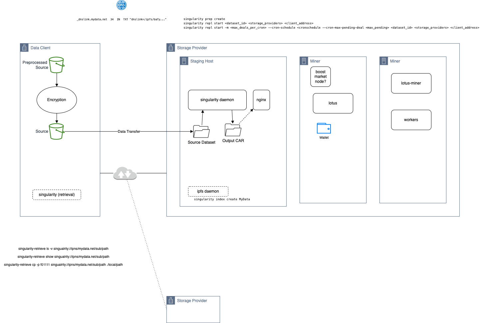

# Filecoin Data Onboarding Guide

Operational guide for data clients and data preparers to onboard datasets into Filecoin storage using the [Singularity tool](https://github.com/tech-greedy/singularity).

## Planning

* Data selection and sizing
* For FIL+ Verified deals, apply for DataCap.
* Select Storage Providers
* Determine responsibilities for Data Preparation & Deal Making. 
I.e. Client-side or Preparer/SP-side. 
* Design data onboarding pattern. Decide Online/offline. 
* Capacity planning
* Scheduling and time estimation

## Designs.

### Design option: Managed online onboarding by SP. 

High-level architecture diagram:

# Runbooks.

## Storage Runbook.

### Data Prep Host setup

> TODO summarized instructions for Singularity, Lotus (Lite), IPFS, IPNS Link.

### Data Prep

> commands here

### Deal Making

> commands here.

### Example Scripts

> TODO.

## Retrieval Runbook.

> TODO.

# Case Study

## Data Preparation and Dealmaking Approach

> narrative.

## Environment overview

* Diagram (sensitive data removed)
* Sizing
* Environment parameters, any specific tuning.

## Test Results

* Throughput, Performance, System utilization

* Test 1

* Test 2

* Test 3
